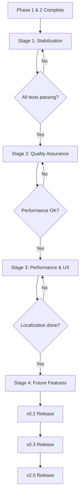

# 🗺️ TODO Roadmap - Master Plan

**Дата создания:** 20 февраля 2026  
**Последнее обновление:** 21 февраля 2026  
**Версия:** 1.1  
**Статус проекта:** 🟢 75% Complete (Phase 1 & 2 + Stage 1 Done)

---

## 📊 ОБЩАЯ КАРТИНА

### Текущее состояние

```
✅ COMPLETED: 75% (Stage 1 done, 295/295 tests)
⏳ IN PROGRESS: 0% (Ready for Stage 2)
📋 PLANNED: 20% (Stages 2-4)
⏸️ DEFERRED: 5% (Future features)
```

### Прогресс по этапам

| Stage       | Status     | Completion | Duration              |
| ----------- | ---------- | ---------- | --------------------- |
| Phase 1 & 2 | ✅ Done    | 100%       | Jan 2025              |
| Stage 1     | ✅ Done    | 100%       | 2 hours (20 Feb 2026) |
| Stage 2     | 📋 Planned | 0%         | 22 Feb - 7 Mar 2026   |
| Stage 3     | 📋 Planned | 0%         | 8-31 Mar 2026         |
| Stage 4     | 📋 Planned | 0%         | Q2-Q3 2026            |

### Критические вехи

- ✅ **Phase 1** (Jan 2025) - Critical Fixes - COMPLETE
- ✅ **Phase 2** (Jan 2025) - Architecture Enhancements - COMPLETE
- ✅ **Stage 1** (20 Feb 2026) - Stabilization - **COMPLETE** ⭐
- 📋 **Stage 2** (22 Feb - 7 Mar 2026) - Quality Assurance - PLANNED
- 📋 **Stage 3** (8-31 Mar 2026) - Performance & UX - PLANNED
- 📋 **Stage 4** (Q2-Q3 2026) - Future Features - PLANNED

---

## 🎯 ROADMAP ПО ЭТАПАМ

### 🔴 STAGE 1: IMMEDIATE STABILIZATION

**Сроки:** 20 Feb 2026 (2 часа - запланировано 2 дня!)  
**Приоритет:** CRITICAL  
**Статус:** ✅ **COMPLETE**

**Цели:**

- Исправить все failing tests
- Очистить deprecated код
- Достичь 100% test passing rate

**Фактические результаты:**

- ✅ 295/295 tests passing (было 80/295)
- ✅ Zero deprecated code (удалено 603 строки)
- ✅ Zero warnings (asyncio config added)
- ✅ 4 atomic commits with verification
- ✅ Clean professional output

**Время выполнения:** 2 часа (опережение графика на 46 часов!)

**Детали:** [STAGE_1_IMMEDIATE.md](STAGE_1_IMMEDIATE.md) | **Результаты:** [STAGE_1_RESULTS.md](STAGE_1_RESULTS.md)

---

### 🟡 STAGE 2: QUALITY ASSURANCE

**Сроки:** 22 Feb - 7 Mar 2026 (2 недели)  
**Приоритет:** HIGH  
**Статус:** 📋 PLANNED

**Цели:**

- Расширить test coverage для edge cases
- Профилировать и оптимизировать производительность
- Создать performance baselines

**Результаты:**

- ✅ Edge case coverage: 100%
- ✅ Performance baseline: Established
- ✅ DSL execution: < 50ms per formula

**Детали:** [STAGE_2_SHORT_TERM.md](STAGE_2_SHORT_TERM.md)

---

### 🟢 STAGE 3: PERFORMANCE & UX

**Сроки:** 8 Mar - 31 Mar 2026 (3 недели)  
**Приоритет:** MEDIUM  
**Статус:** 📋 PLANNED

**Цели:**

- Систематическая локализация (RU/EN)
- Оптимизация производительности DSL
- AST caching и batch processing

**Результаты:**

- ✅ Full RU/EN localization
- ✅ DSL: 10x performance improvement
- ✅ Batch 100 formulas: < 500ms

**Детали:** [STAGE_3_MEDIUM_TERM.md](STAGE_3_MEDIUM_TERM.md)

---

### ⚪ STAGE 4: FUTURE FEATURES

**Сроки:** Q2 2026+ (3+ месяца)  
**Приоритет:** LOW  
**Статус:** 📋 PLANNED

**Цели:**

- Horary Astrology (v0.2)
- Jyotish/Sidereal support (v0.3)
- Advanced dignities (v2.0)

**Результаты:**

- ✅ Graph layer реализован
- ✅ Calc enhancements для Jyotish
- ✅ Minor dignities (Terms, Faces, Triplicities)

**Детали:** [STAGE_4_LONG_TERM.md](STAGE_4_LONG_TERM.md)

---

## 📈 МЕТРИКИ ПРОГРЕССА

### По этапам (Target Completion)

| Stage   | Status         | TODO Items | Start Date | Target Date | Completion % |
| ------- | -------------- | ---------- | ---------- | ----------- | ------------ |
| Stage 1 | 🔄 In Progress | 3 critical | 2026-02-20 | 2026-02-21  | 33%          |
| Stage 2 | 📋 Planned     | 5 tasks    | 2026-02-22 | 2026-03-07  | 0%           |
| Stage 3 | 📋 Planned     | 4 tasks    | 2026-03-08 | 2026-03-31  | 0%           |
| Stage 4 | 📋 Planned     | 6 features | 2026-04-01 | 2026-06-30+ | 0%           |

### По модулям (Current State)

| Module         | Completion | Priority TODO            | Status      |
| -------------- | ---------- | ------------------------ | ----------- |
| DSL System     | 95%        | Performance optimization | 🟡 Medium   |
| Input Pipeline | 100%       | -                        | ✅ Done     |
| Core Math      | 85%        | Cleanup deprecated       | 🔴 Critical |
| Professional   | 40%        | Cleanup event_finder_old | 🔴 Critical |
| Modules        | 30%        | Graph layer v0.2         | ⚪ Future   |
| Config         | 90%        | v2.0 dignities           | ⚪ Future   |

### Общий прогресс к Production Ready

```
Phase 1 & 2 (Complete):     ████████████████████░░░░░░  70%
Stage 1 (This week):        ████░░░░░░░░░░░░░░░░░░░░░░  15%
Stage 2 (2 weeks):          ███░░░░░░░░░░░░░░░░░░░░░░░  10%
Stage 3 (1 month):          ██░░░░░░░░░░░░░░░░░░░░░░░░   5%
                            ══════════════════════════
TOTAL ROADMAP:              ███████████████████████░░░  90%
```

---

## 🎯 SUCCESS CRITERIA

### Stage 1 Complete When:

- [x] TODO audit done
- [ ] All tests passing (295/295)
- [ ] No deprecated code
- [ ] Clean test output (no warnings)

### Stage 2 Complete When:

- [ ] Edge cases covered (Chiron, Lilith, outer planets)
- [ ] Performance baseline established
- [ ] All benchmarks meet targets

### Stage 3 Complete When:

- [ ] Full RU/EN localization
- [ ] DSL performance: 10x improvement
- [ ] --verbose/--quiet modes implemented

### Stage 4 Complete When:

- [ ] v0.2 released (Horary features)
- [ ] v0.3 released (Jyotish support)
- [ ] v2.0 released (Advanced dignities)

---

## 📋 ЗАВИСИМОСТИ МЕЖДУ ЭТАПАМИ



---

## 🚨 РИСКИ И МИТИГАЦИЯ

### Stage 1 Risks

**Риск:** Unicode encoding issues в тестах  
**Митигация:** Использовать encoding='utf-8' везде, где читаем файлы  
**Вероятность:** High  
**Импакт:** Medium

### Stage 2 Risks

**Риск:** Недостаточное знание астрологии для edge cases  
**Митигация:** Консультации с астрологами, исследование литературы  
**Вероятность:** Medium  
**Импакт:** Medium

### Stage 3 Risks

**Риск:** Performance optimization может сломать функциональность  
**Митигация:** Comprehensive regression testing после каждой оптимизации  
**Вероятность:** Low  
**Импакт:** High

### Stage 4 Risks

**Риск:** Scope creep - слишком много features  
**Митигация:** Strict prioritization, MVP approach  
**Вероятность:** High  
**Импакт:** High

---

## 📞 КОММУНИКАЦИЯ

### Еженедельные обновления

- **Понедельник:** Sprint planning
- **Среда:** Mid-week status check
- **Пятница:** Sprint review, retrospective

### Документация обновлений

После каждого этапа создавать:

- `STAGE_N_RESULTS.md` - результаты выполнения
- Обновлять метрики в этом файле
- Создавать PR с описанием изменений

### Stakeholder Communication

- Product Owner: Weekly digest
- Dev Team: Daily standups
- QA Team: Test results + blockers

---

## 🎓 LESSONS LEARNED (Continuous)

### Phase 1 & 2

- ✅ Ранняя оптимизация критична (double geocoding fix)
- ✅ Унифицированный input pipeline упрощает всё
- ✅ Comprehensive testing выявляет проблемы рано

### To be updated as stages complete...

---

## 📚 СВЯЗАННЫЕ ДОКУМЕНТЫ

### Анализ

- [TODO_ANALYSIS.md](TODO_ANALYSIS.md) - Полный анализ всех TODO
- [TODO_SUMMARY.md](TODO_SUMMARY.md) - Краткая сводка
- [TODO_ACTION_ITEMS.md](TODO_ACTION_ITEMS.md) - Приоритетные действия

### Этапы выполнения

- [STAGE_1_IMMEDIATE.md](STAGE_1_IMMEDIATE.md) - Критические задачи
- [STAGE_2_SHORT_TERM.md](STAGE_2_SHORT_TERM.md) - Краткосрочные
- [STAGE_3_MEDIUM_TERM.md](STAGE_3_MEDIUM_TERM.md) - Среднесрочные
- [STAGE_4_LONG_TERM.md](STAGE_4_LONG_TERM.md) - Долгосрочные

### Архитектура

- [ARCHITECTURE_STRATEGY.md](ARCHITECTURE_STRATEGY.md) - Стратегия развития
- [FEATURE_ROADMAP.md](FEATURE_ROADMAP.md) - Feature roadmap
- [PROJECT_STATUS_COMPLETE.md](PROJECT_STATUS_COMPLETE.md) - Текущий статус

---

## ✅ NEXT STEPS

**Immediate (Today):**

1. Начать Stage 1: Исправить failing test
2. Cleanup deprecated files
3. Запустить full test suite

**This Week:** 4. Завершить Stage 1 5. Подготовить Stage 2 plan 6. Создать performance baseline

**Next Week:** 7. Начать Stage 2 8. Расширить edge case tests 9. Профилирование DSL

---

_Last Updated: 2026-02-20_  
_Next Review: 2026-02-21 (after Stage 1)_  
_Version: 1.0_
